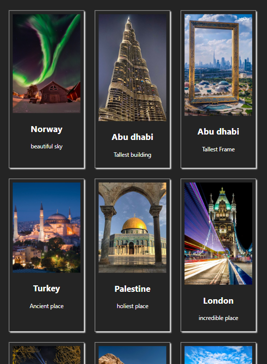

# Reusable components
I created reusable input, button, list, card and modal components in react js using prop-types library.

Here is a glimple of one the component.!!

I created a reusable Card component built with React. This component is designed to display a title, image, and description that can be used in multiple places within an application with minimal or no modification. These components should be self-contained, accept props to customize their behavior and appearance, and be easy to compose with other components. Also i used some CSS to look interactive.

## 📸 Screenshot

### Notes:
Reusable components in React can significantly enhance development efficiency and code maintainability. By designing components that are modular, customizable via props, and easy to compose

